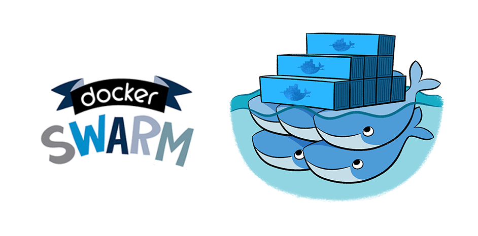

<p align="center">

</p>

A lightweight starter kit for quickly spinning up a development and deployment platform using Docker Swarm.

## Full workflow (step-by-step)

### 1️⃣ Clone

```bash
git clone https://github.com/rizort/docker-swarm-skeleton.git
cd swarm-deploy
```

---

### 2️⃣ Initialize configuration

Before running the project, create a local `.env` from the template:

```bash
make init
```

> The `.env` file is used by Docker Compose (to substitute variables in `docker-compose.yml`) and inside the container as the source for environment values.

---

### 3️⃣ Development

Runs the stack locally via `docker compose`.
The code from `src/` is mounted into the container — changes are visible immediately without rebuilding.

```bash
make dev-up
```

Open browser: http://localhost

Stop:

```bash
make dev-down
```

---

### 4️⃣ Release version (semver + push to registry)

The version is stored in `.env`. Commands automatically bump the appropriate part, build the images and push it to the registry.

Choose release type:

```bash
make release-patch   # 1.2.3 → 1.2.4  (bugfix)
make release-minor   # 1.2.3 → 1.3.0  (new feature)
make release-major   # 1.2.3 → 2.0.0  (breaking changes)
```

---

### 5️⃣ Deploy to VPS (remote Swarm)

The `make deploy` target deploys your stack to a remote Docker Swarm manager via SSH.

What happens:
1. Copies `docker-compose.yml` and `docker-compose.prod.yml` to the remote `REMOTE_DIR`
2. Optionally logs in to the registry (if `REGISTRY_USER` and `REGISTRY_PASSWORD` are set)
3. If `APP_SECRET` is set in `.env`, it is created/updated as a Docker secret (`app_secret`) on the remote host and mounted into the `php` service at `/run/secrets/app_secret`
4. Runs `docker stack deploy` on the remote host using `STACK_NAME`, `REGISTRY` and `TAG`
5. Uses `--prune` to remove any services that are no longer defined in the compose files
---

### 🔐 Using Docker secrets in PHP

The deploy flow creates/updates a Docker secret named `app_secret` if `APP_SECRET` is set in `.env`. In the container it is mounted as a file at:

```
/run/secrets/app_secret
```

We also expose the path via an environment variable so your app can locate it:

```
APP_SECRET_FILE=/run/secrets/app_secret
```

Example PHP usage:

```php
$secretFile = getenv('APP_SECRET_FILE');
$secret = $secretFile ? trim(file_get_contents($secretFile)) : null;
```

## 🔧 All commands

| Command | What it does |
|---|---|
| `make init` | Creates `.env` from `.env.dist` |
| `make build` | Build PHP and nginx images |
| `make push` | Push images to the registry |
| `make release-patch` | Bump patch + build + push |
| `make release-minor` | Bump minor + build + push |
| `make release-major` | Bump major + build + push |
| `make dev-up` | Start local stack (with mount) |
| `make dev-down` | Stop local stack |
| `make prod-up` | Start Swarm stack locally |
| `make prod-down` | Stop local Swarm stack |
| `make status` | Show swarm stack services (local) |
| `make deploy` | Deploy to remote Swarm via SSH |

